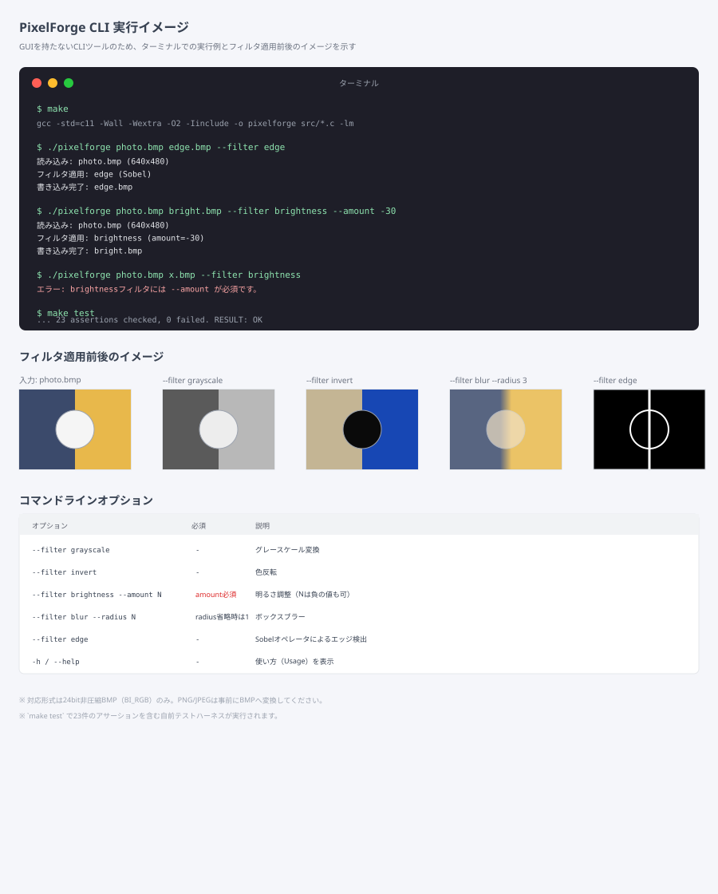
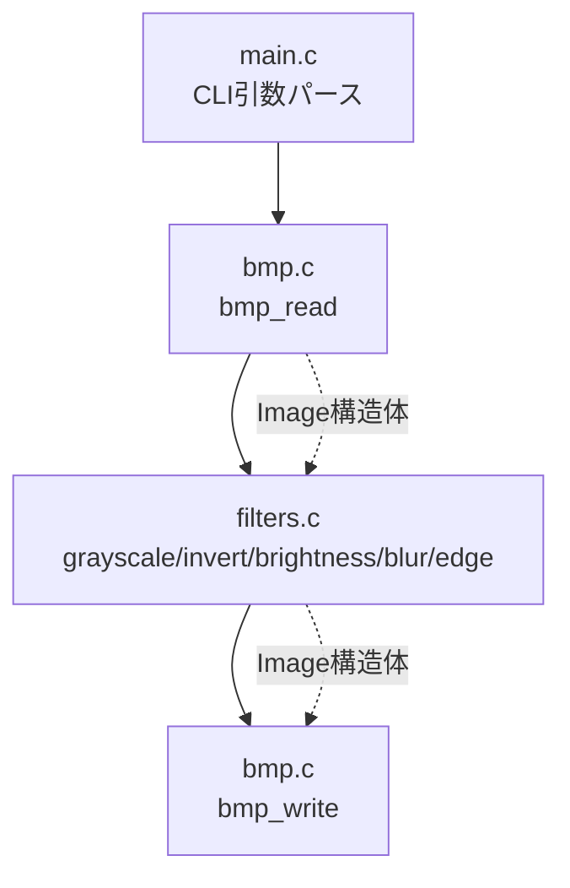
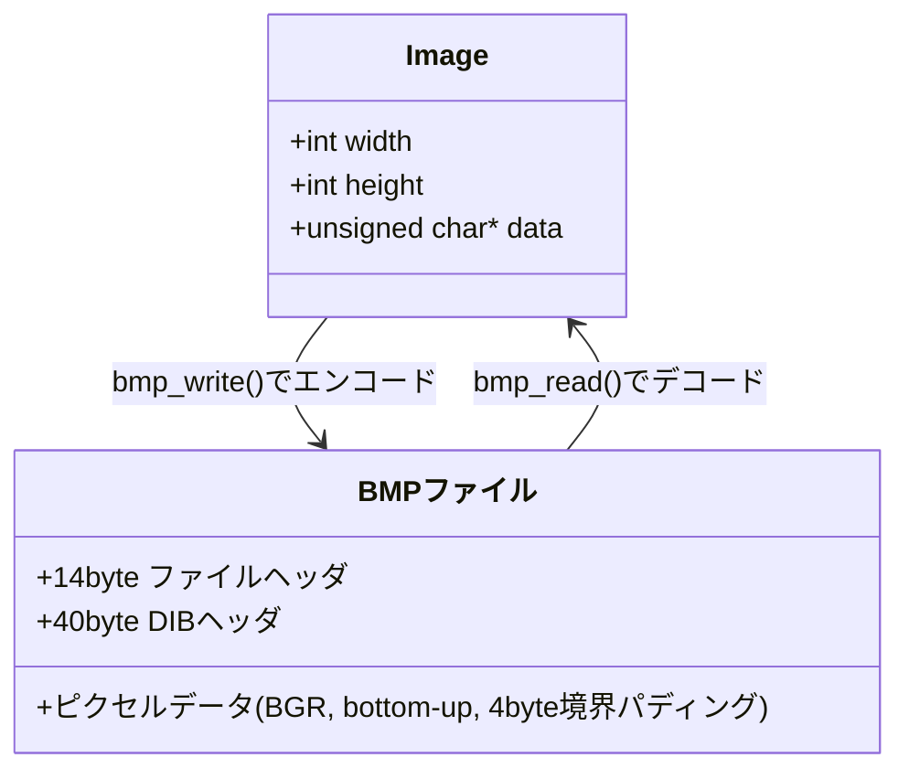

# PixelForge（ピクセルフォージ）

BMP画像にグレースケール・反転・明るさ調整・ぼかし・エッジ検出を適用できる、依存ライブラリゼロのC言語製CLIツール

## 目次

- [概要](#概要)
- [特徴（主な機能）](#特徴主な機能)
- [想定ユーザー（ペルソナ）](#想定ユーザーペルソナ)
- [UIイメージ](#uiイメージ)
- [技術スタック](#技術スタック)
- [システム構成図](#システム構成図)
- [データ構造](#データ構造)
- [セットアップ](#セットアップ)
- [今後の展望](#今後の展望)

## 概要

画像処理の基本アルゴリズム（グレースケール変換、ぼかし、エッジ検出など）を学ぶ際、Pythonなら`Pillow`や`OpenCV`を使えば数行で済んでしまい、内部で何が起きているかがブラックボックスになりがちです。

PixelForge は、外部の画像処理ライブラリを一切使わず、BMPファイルのバイナリ構造の読み書きから、畳み込み演算によるぼかし・Sobelオペレータによるエッジ検出までをすべて自前のCコードで実装したCLIツールです。1枚のBMP画像を入力し、フィルタを指定するだけで加工後の画像を出力します。

## 特徴（主な機能）

| # | 機能 | 内容 |
| --- | --- | --- |
| 1 | BMP読み込み・書き込み | 24bit非圧縮BMP（BI_RGB）をバイト単位で自前パース。行パディングやBGR順、上下反転（bottom-up/top-down）を正しく処理 |
| 2 | グレースケール変換 | ITU-R BT.601の輝度係数（0.299R+0.587G+0.114B）でRGBを輝度値に変換 |
| 3 | 色反転 | 各チャンネルを255-値に反転し、ネガポジ反転画像を生成 |
| 4 | 明るさ調整 | 指定量（負の値も可）を各チャンネルに加算し、0〜255にクランプ |
| 5 | ボックスブラー | 指定半径の正方形ウィンドウで平均を取る畳み込みぼかし。端は同じ画素のクランプで処理 |
| 6 | エッジ検出（Sobel） | 輝度画像に対しSobelのGx/Gyカーネルを畳み込み、勾配の大きさ`sqrt(Gx²+Gy²)`をエッジ強度として出力 |
| 7 | CLIエラーハンドリング | 引数不足・未対応フィルタ・非対応BMP形式などをわかりやすい日本語メッセージで通知 |

## 想定ユーザー（ペルソナ）

**ペルソナ①：田中悠斗（20歳・情報系学部の学生）**
- 画像処理アルゴリズム（畳み込み、エッジ検出）の授業で理論を学んだが、実際にビット単位でどう処理されるかを手を動かして理解したい
- OpenCVを使えば一瞬だが、それだと「中身がわからないまま動く」ので避けたい
- コマンドライン一発で結果画像を確認しながら、パラメータ（ぼかし半径など）を変えて挙動を試したい

**ペルソナ②：小林彩花（27歳・組み込みソフトウェアエンジニア）**
- リソースが限られた環境（外部ライブラリを入れられない、あるいは入れたくない）向けの画像処理コードのリファレンス実装が欲しい
- BMPのようなシンプルな形式のパーサーを、依存なしでどう書くかの実例を確認したい
- CIで自動テストできる、依存の少ないC言語のサンプルプロジェクトとして使いたい

## UIイメージ



GUIを持たないCLIツールのため、上図はターミナルでの実行例（コマンドと出力ログ）、および各フィルタ適用前後の画像イメージのモックアップです。

- `--filter grayscale` / `invert` / `brightness --amount N` / `blur --radius N` / `edge` の5種類をサブコマンドではなくオプションとして指定
- 実行すると読み込んだ画像のサイズ、適用したフィルタ、書き込み先パスがログとして表示される
- 引数不足や非対応フィルタ指定時は、使い方（Usage）を含むエラーメッセージを表示して終了コード1を返す

## 技術スタック

| 分類 | 技術 | 選定理由 |
| --- | --- | --- |
| 言語 | C（C11） | 画像処理のバイト単位の操作や、依存ゼロでの実装を学ぶ題材として最も直接的 |
| 画像形式 | BMP（24bit非圧縮） | ヘッダ構造が単純で、外部ライブラリなしで確実にパース・生成できる |
| ビルドツール | Make | 追加のビルドシステム導入なしに、`make` / `make test` だけでビルド・テストが完結する |
| テスト | 自前の最小テストハーネス（`tests/test_harness.h`） | CUnit等の外部フレームワークをインストールせずに、`assert`ベースのテストをどの環境でも実行できるようにするため |
| 数学関数 | `math.h`（`sqrt`） | Sobelエッジ検出の勾配の大きさの計算に使用（リンク時に`-lm`が必要） |

## システム構成図



`main.c`がコマンドライン引数を解釈し、`bmp.c`が入力ファイルを共通の`Image`構造体（RGB・上から下の順のバイト列）へデコードします。`filters.c`はこの`Image`構造体だけに依存する純粋な画像処理関数群で、BMPのファイル形式を一切知りません。最後に再び`bmp.c`が`Image`構造体をBMPバイナリへエンコードして書き出します。

## データ構造

PixelForgeはファイルベースのCLIツールで、リレーショナルデータベースは持たないため、ER図の代わりに中核データ構造を示します。



| データ | 役割 | 生成・変換箇所 |
| --- | --- | --- |
| `Image`構造体 | 幅・高さと、RGB・上から下の順に並んだピクセルバイト列を保持する、フィルタ処理の共通データ形式 | `bmp_read()`でBMPからデコード、各`filter_*()`関数が読み書き |
| BMPファイル | 24bit非圧縮のWindows Bitmap形式。BGR順・下から上・4byte境界パディングという、`Image`構造体とは異なる制約を持つ | `bmp_write()`で`Image`からエンコード |

## セットアップ

1. GCC（またはClang）とMakeをインストール（Linux/macOSは標準搭載のことが多い。Windowsは[MinGW-w64](https://www.mingw-w64.org/)やWSLを利用）
2. ビルド
   ```
   make
   ```
3. テストを実行（任意）
   ```
   make test
   ```
4. 実行例
   ```
   ./pixelforge photo.bmp gray.bmp --filter grayscale
   ./pixelforge photo.bmp bright.bmp --filter brightness --amount 30
   ./pixelforge photo.bmp blur.bmp --filter blur --radius 3
   ./pixelforge photo.bmp edge.bmp --filter edge
   ```
5. 入力画像は24bit非圧縮BMPのみ対応。JPEGやPNGを使いたい場合は、事前にペイントソフトや`ImageMagick`（`convert input.jpg input.bmp`）などでBMPに変換してください。

## 今後の展望

「BMP読み書き」「グレースケール」「反転」「明るさ調整」「ボックスブラー」「Sobelエッジ検出」までを実装済みとし、以下は今後の拡張として位置づけます。

- PNG/JPEGの直接読み込み対応（自前デコーダまたは外部ライブラリの選択制導入）
- ガウシアンブラー、シャープ化（アンシャープマスク）など追加フィルタ
- 複数フィルタのパイプライン適用（`--filter grayscale,edge`のような連結指定）
- 大きな画像に対する処理速度向上（SIMD命令の活用、マルチスレッド化）
- コントラスト自動調整（ヒストグラム平坦化）

開発メモ：本アプリは継続的に機能を追加予定です。サンドボックス環境・お手元の環境どちらでもGCC/Makeがあれば同じ手順でビルド・テストできることを確認しています。
